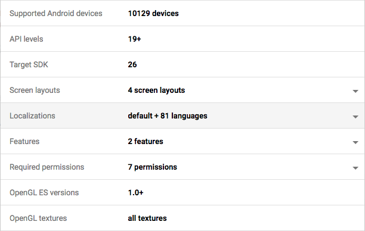

# Gradle Android L10N Fix Plugin

This plugin fixes the [compile-time language resource contamination
problem](https://gist.github.com/amake/0ac7724681ac1c178c6f95a5b09f03ce#compile-time-contamination),
which breaks display-language fallback according to user preferences on Android
7.

The plugin works by inspecting your `res` folder hierarchy to detect what
locales your app supports, and filters out unwanted locales by setting the
appropriate
[`resConfig`](https://google.github.io/android-gradle-dsl/current/com.android.build.gradle.internal.dsl.DefaultConfig.html#com.android.build.gradle.internal.dsl.DefaultConfig:resConfig%28java.lang.String%29)
filters.

Additionally it generates an array of supported locales accessible at runtime
via `BuildConfig.SUPPORTED_LOCALES`. You can use this to fix the [runtime
resource contamination
problem](https://gist.github.com/amake/0ac7724681ac1c178c6f95a5b09f03ce#runtime-contamination)
caused by the Chrome WebView in Android 7.

## Do I need this?

- Does your app support more than one locale (language)?
- Do you use the AppCompat library? Any Google Play Services libraries?

Go check how many localizations Google thinks you support on the Google Play Console:



Surprised?

You can also check your APK directly yourself. Here's the result for the default
new project template app created by Android Studio 3.1:

```
$ ./gradlew assemble

BUILD SUCCESSFUL in 5s
51 actionable tasks: 1 executed, 50 up-to-date
$ $ANDROID_HOME/build-tools/27.0.3/aapt d --values resources app/build/outputs/apk/release/app-release-unsigned.apk resources.arsc | grep -E 'config ([a-z]{2}(-r[A-Z]{2})?|b\+[a-zA-Z+]+):' | sort | uniq
      config af:
      config am:
      config ar:
      config az:
      config b+sr+Latn:
      config be:
      config bg:
      config bn:
      config bs:
      config ca:
      config cs:
      config da:
      config de:
      config el:
      config en-rAU:
      config en-rCA:
      config en-rGB:
      config en-rIN:
      config en-rXC:
      config es-rUS:
      config es:
      config et:
      config eu:
      config fa:
      config fi:
      config fr-rCA:
      config fr:
      config gl:
      config gu:
      config hi:
      config hr:
      config hu:
      config hy:
      config in:
      config is:
      config it:
      config iw:
      config ja:
      config ka:
      config kk:
      config km:
      config kn:
      config ko:
      config ky:
      config lo:
      config lt:
      config lv:
      config mk:
      config ml:
      config mn:
      config mr:
      config ms:
      config my:
      config nb:
      config ne:
      config nl:
      config pa:
      config pl:
      config pt-rBR:
      config pt-rPT:
      config pt:
      config ro:
      config ru:
      config si:
      config sk:
      config sl:
      config sq:
      config sr:
      config sv:
      config sw:
      config ta:
      config te:
      config th:
      config tl:
      config tr:
      config uk:
      config ur:
      config uz:
      config vi:
      config zh-rCN:
      config zh-rHK:
      config zh-rTW:
      config zu:
```

## Usage

1. Add the plugin to your root project
   ([instructions](https://plugins.gradle.org/plugin/com.madlonkay.android-l10n-fix))
2. Apply the plugin to your Android app or library. This is the project to which
   the `com.android.*` plugin is applied.
    ```
    // Make sure this comes *after* the Android plugin is applied
    apply plugin: 'com.madlonkay.android-l10n-fix'
    ```
3. Optionally configure the plugin with a `l10n` block. See below for options.

## Configuration

In the same project you applied the plugin to:

```
l10n {
    defaultLocale = 'en'
}
```

Options:

- `defaultLocale`: The locale for "default" resources (i.e. in `values`, not
  `values-XX`). This defaults to `en`.

## License

Apache 2.0

## See also

- [Correct localization on Android
  7](https://gist.github.com/amake/0ac7724681ac1c178c6f95a5b09f03ce)
